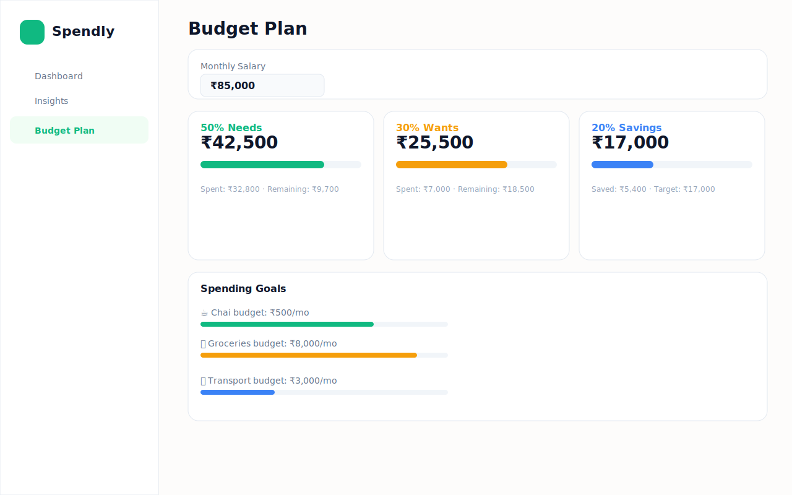
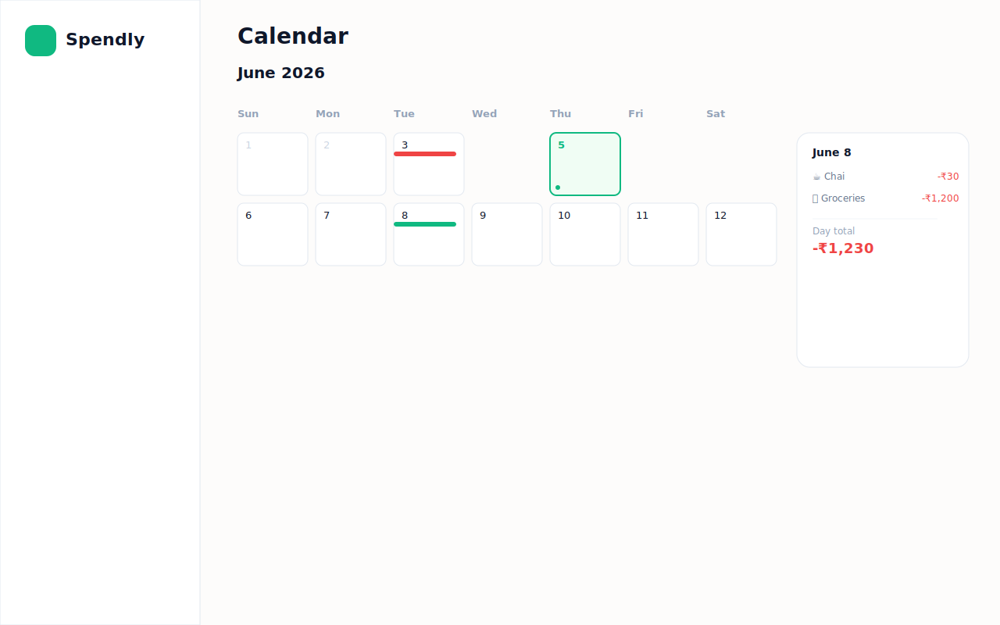
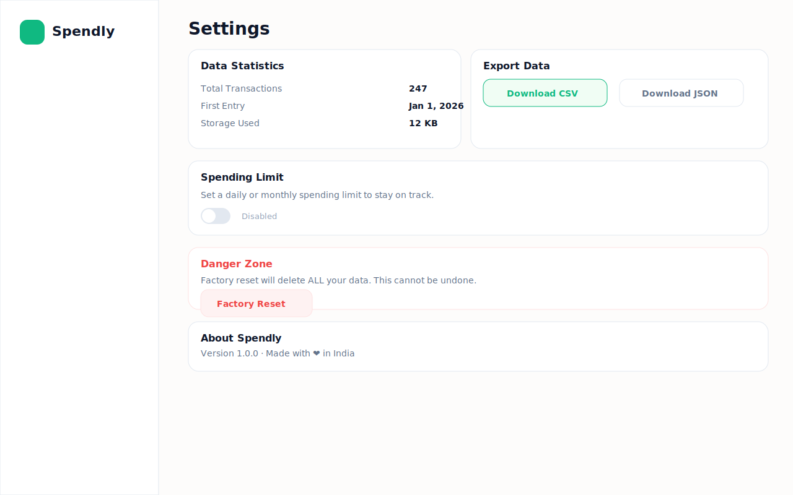

<p align="center">
  
</p>

<h1 align="center">Spendly</h1>

<p align="center">
  <strong>Track Daily, Spend Happily 💸</strong>
</p>

<p align="center">
  A beautiful, privacy-first daily expense tracker built for India.<br/>
  Track every rupee — from your morning ₹10 chai to your monthly ₹50K salary —<br/>
  with zero sign-ups, zero servers, and zero hassle.
</p>

<p align="center">
  <a href="https://spendly.vercel.app" target="_blank">
    
  </a>
  
  
  
  
  
</p>

---

## Screenshots

<p align="center">
  <em>Beautiful interface across every screen</em>
</p>

| Dashboard | Analytics | Budget Planner |
|:---------:|:---------:|:--------------:|
|  |  |  |

| Calendar | History | Settings |
|:--------:|:-------:|:--------:|
|  |  |  |

---

## Features

| Feature | Description |
|---------|-------------|
| **2-Second Logging** | Tap, pick from 19+ Indian daily presets (chai, Swiggy, auto, petrol...), enter amount — done. |
| **Smart Dashboard** | Live balance, income, expenses, and savings at a glance with beautiful stat cards. |
| **Rich Analytics** | 5 chart types — area trends, donut breakdown, spending heatmap, income vs expense, and smart insight cards. |
| **50/30/20 Budget Planner** | Enter your salary and see your Needs / Wants / Savings limits with real-time progress bars. |
| **Calendar View** | Visual calendar with daily spending breakdown and recurring transaction indicators. |
| **Search & Filter History** | Full-text search across all transactions. Filter by type (income/expense) or budget category. |
| **Delete & Edit Transactions** | Hover over any entry in History to reveal edit/delete buttons with confirmation prompts. |
| **Recurring Transactions** | Set up daily, weekly, or monthly recurring entries that auto-fire. |
| **Spending Goals** | Set category-wise spending limits and track progress with visual bars. |
| **Spending Limits** | Set daily or monthly spending caps with toggle controls. |
| **Data Export** | Download all your data as CSV or JSON from the Settings page. |
| **Dark Mode** | Toggle between light and dark themes with persistent preference. |
| **Splash Screen** | Beautiful animated splash with logo, title, and loading dots. |
| **100% Private** | No accounts, no servers, no tracking. Everything lives in your browser's `localStorage`. |
| **Fully Responsive** | Looks great on mobile, tablet, and desktop with adaptive sidebar and bottom navigation. |
| **Stunning Landing Page** | Full-screen hero, scroll animations, phone mockup, feature cards, and CTA sections. |

---

## Quick Start

### Prerequisites

- [Node.js](https://nodejs.org/) v18 or higher
- npm (comes with Node.js)

### Installation

```bash
# 1. Clone the repository
git clone https://github.com/CodingWithDodamani/Spendly.git
cd Spendly

# 2. Install dependencies
npm install

# 3. Start the development server
npm run dev
```

The app will open at **http://localhost:5173**.

### Build for Production

```bash
npm run build
```

This generates a single-file build (thanks to `vite-plugin-singlefile`) in the `dist/` folder — perfect for sharing as a standalone HTML file.

### Type Checking

```bash
npm run typecheck
```

---

## Deployment

### Vercel (Recommended)

1. Push your code to GitHub
2. Go to [vercel.com](https://vercel.com) → **Add New Project**
3. Import your `Spendly` repository
4. Vercel auto-detects: **Framework: Vite**, **Build: `npm run build`**, **Output: `dist`**
5. Click **Deploy**
6. Your app is live at `https://spendly.vercel.app`

### Netlify

1. Push your code to GitHub
2. Go to [app.netlify.com](https://app.netlify.com) → **Add new site** → **Import an existing project**
3. Select GitHub and your repository
4. Build command: `npm run build`, Publish directory: `dist`
5. Click **Deploy site**

### GitHub Pages

```bash
# Install gh-pages
npm install -D gh-pages

# Add to package.json scripts
"predeploy": "npm run build",
"deploy": "gh-pages -d dist"

# Deploy
npm run deploy
```

---

## Project Structure

```
Spendly/
├── public/                      # Static assets
│   ├── logo.svg                 # Spendly logo (extracted SVG)
│   ├── og-image.svg             # Social sharing image template
│   ├── github-banner.png        # GitHub repo banner
│   └── site.webmanifest         # PWA manifest
├── docs/
│   └── screenshots/             # App screenshots for README
├── src/
│   ├── main.tsx                 # React root mount
│   ├── App.tsx                  # Main app shell (sidebar, nav, routing, state)
│   ├── index.css                # Global styles, animations, scroll-reveal
│   ├── hooks/
│   │   └── useLocalStorage.ts   # Persisted state hook with validation
│   ├── utils/
│   │   ├── validation.ts        # Transaction schema & validation
│   │   ├── formatters.ts        # INR currency formatting (₹)
│   │   └── colors.ts            # Design tokens & chart palette
│   ├── components/
│   │   ├── AddTransactionModal.tsx   # Quick-pick expense/income modal
│   │   ├── BudgetCard.tsx            # 50/30/20 progress card
│   │   ├── EmptyPlaceholder.tsx      # Empty-state dashed placeholder
│   │   ├── InfoTooltip.tsx           # Hover tooltip component
│   │   ├── MonthlySummary.tsx        # Monthly summary component
│   │   ├── NavItem.tsx               # Sidebar + mobile nav items
│   │   ├── SpendlyLogo.tsx           # SVG logo component
│   │   ├── SpendingGoalCard.tsx      # Spending goal tracker
│   │   ├── StatCard.tsx              # Dashboard stat card
│   │   └── TransactionRow.tsx        # Single transaction display row
│   └── views/
│       ├── AboutView.tsx             # Landing/about page (full-screen)
│       ├── AnalyticsView.tsx         # Charts, heatmap, insights
│       ├── BudgetPlannerView.tsx     # 50/30/20 salary planner
│       ├── CalendarView.tsx          # Calendar with daily breakdown
│       ├── DashboardView.tsx         # Main dashboard with charts
│       ├── SettingsView.tsx          # Data export, factory reset
│       └── TransactionsView.tsx      # Full history with search/filter
├── index.html                   # Entry HTML with meta tags & favicon
├── package.json                 # Dependencies & scripts
├── vite.config.ts               # Vite + React + Tailwind + SingleFile plugin
├── tsconfig.json                # TypeScript configuration
├── vercel.json                  # Vercel deployment config
├── LICENSE                      # MIT License
└── README.md                    # This file
```

---

## Tech Stack

| Technology | Purpose |
|------------|---------|
| **React 19** | UI framework with hooks |
| **Vite 7** | Lightning-fast dev server & bundler |
| **TypeScript** | Type-safe code with strict mode |
| **Tailwind CSS 4** | Utility-first styling |
| **Recharts** | Beautiful, responsive charts |
| **Lucide React** | Consistent icon set |
| **localStorage** | Zero-dependency data persistence |

---

## Pages & Navigation

| Page | Tab | Description |
|------|-----|-------------|
| **Landing / About** | `about` | Full-screen marketing page with hero, features, and CTA |
| **Dashboard** | `dashboard` | Balance, stat cards, spending chart, recent transactions |
| **Insights** | `analytics` | Spending trends, donut chart, heatmap, income vs expense |
| **Budget Plan** | `budget` | 50/30/20 rule with salary input and live progress bars |
| **Calendar** | `calendar` | Visual calendar with daily spending and recurring indicators |
| **History** | `transactions` | All transactions with search, filter, date grouping, delete |
| **Settings** | `settings` | Data stats, CSV/JSON export, spending limits, factory reset |

---

## Privacy

Spendly takes privacy seriously:

- **No accounts** — No sign-up, no login, no emails
- **No servers** — Zero API calls, zero cloud storage
- **No tracking** — No analytics, no cookies, no fingerprinting
- **Your browser only** — All data lives in `localStorage` and never leaves your device

---

## Contributing

Contributions are welcome! Here's how:

1. Fork the repository
2. Create a feature branch (`git checkout -b feature/amazing-feature`)
3. Commit your changes (`git commit -m 'Add amazing feature'`)
4. Push to the branch (`git push origin feature/amazing-feature`)
5. Open a Pull Request

---

## License

This project is open source and available under the [MIT License](LICENSE).

---

<p align="center">
  Made with ❤️ in India · <strong>Spendly</strong> · Track daily, spend happily ✨
</p>
